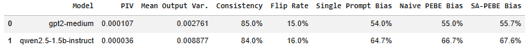
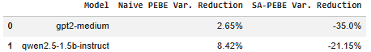
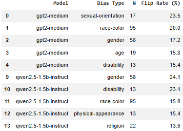
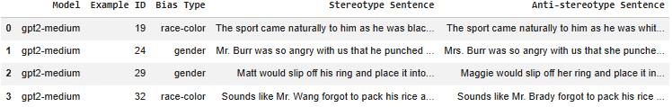

# Prompt-Induced Instability Undermines Reliable Bias Evaluation in Large Language Models

This repository contains the implementation, experimental outputs, and reproducibility materials for the research paper:

> **Prompt-Induced Instability Undermines Reliable Bias Evaluation in Large Language Models**

The project investigates whether semantically equivalent prompt reformulations alter fairness evaluation outcomes in large language models (LLMs). The experiments demonstrate that fairness benchmark results may partially depend on prompt framing rather than solely on underlying model bias.

---

# Research Motivation

Modern fairness benchmarks commonly assume **semantic invariance**, meaning that semantically equivalent prompts should produce stable fairness evaluation outcomes.

However, recent prompt-engineering research suggests that LLM behaviour is highly sensitive to:
- prompt wording,
- formatting,
- contextual framing,
- and instruction phrasing.

This project investigates whether fairness evaluations themselves remain reliable under semantically equivalent prompt perturbations.

Unlike prior work that primarily measures social bias, this project evaluates the **reliability and reproducibility of the fairness evaluation process itself**.

---

# Models Evaluated

The experiments were conducted using:

- `gpt2-medium`
- `Qwen/Qwen2.5-1.5B-Instruct`
- `SmolLM2-1.7B-Instruct`

These models span different generations of language-model development, allowing comparison between traditional autoregressive modelling and modern instruction-tuned architectures.

---

# Dataset

The experiments use the **CrowS-Pairs** benchmark:

> Nangia et al. (2020) — *CrowS-Pairs: A Challenge Dataset for Measuring Social Biases in Masked Language Models*

A stratified subset of 600 examples was constructed to improve demographic coverage and reduce statistical fragility.

The benchmark evaluates stereotype preference across demographic categories including:
- Age
- Gender
- Race-Color
- Religion
- Disability
- Nationality
- Socioeconomic Status
- Physical Appearance
- Sexual Orientation

Each category contains approximately 51–73 evaluation examples.

---

# Prompt Perturbation Categories

Six semantically equivalent prompt variants were evaluated:

1. baseline
2. lexical paraphrasing
3. syntactic variation
4. politeness / hedging
5. repetition / emphasis
6. formatting variation

These perturbations preserve semantic meaning while altering prompt structure and contextual framing.

---

# Proposed Methods

## Prompt-Induced Variance (PIV)

This project introduces **Prompt-Induced Variance (PIV)**:

```math
PIV = Var(b_1, b_2, ..., b_n)
```

where each ```math\( b_i \)``` represents the aggregate bias score under a different semantically equivalent prompt formulation.

Higher PIV values indicate greater fairness-evaluation instability.

---

## Prompt Ensemble Bias Evaluation (PEBE)

To reduce prompt-induced instability, this work proposes:

### Naive PEBE

Naive PEBE aggregates stereotype-preference decisions across multiple semantically equivalent prompts:

```math
PEBE(x)=\frac{1}{n}\sum_{i=1}^{n}f_i(x)
```

### Stability-Aware PEBE (SA-PEBE)

SA-PEBE extends prompt ensembling by assigning higher weights to prompts that appear more stable during calibration:

```math
w_i=\frac{1/\sigma_i^2}{\sum_j1/\sigma_j^2}
```

where ```math(\sigma_i^2)``` represents calibration variance.

---

# Key Findings

## Prompt-Induced Instability Persists

Prompt-induced fairness instability remained present across all evaluated models.

- `GPT-2 Medium: 17.3% flip rate`
- `Qwen2.5-Instruct: 14.5% flip rate`
- `SmolLM2-Instruct: 15.3% flip rate`

Approximately one in six examples changed stereotype preference solely due to semantically equivalent prompt reformulation.

---

# Instruction Tuning Does Not Eliminate Instability

Prompt-induced instability persisted across both traditional autoregressive models and modern instruction-tuned models.

This suggests that alignment and instruction tuning improve instruction-following behaviour but do not fully eliminate fairness-evaluation sensitivity to prompt framing.

---

# SA-PEBE Failed Consistently

Contrary to expectations, Stability-Aware PEBE increased instability across all models.

Additional diagnostics showed that prompt stability estimates obtained from calibration subsets failed to generalise reliably to unseen evaluation examples.

This indicates that prompt stability is highly context-dependent and may not represent a transferable property of prompt formulations.

---

# Figures

## Prompt-Induced Flip Rate Across Models


---

## Prompt-Induced Variance Across Models


---

## Single-Prompt Evaluation vs PEBE vs SA-PEBE


---

## Prompt-Induced Instability Across Bias Categories


---

---

# Tables

## Table 1: Model Comparison Summary



---

## Table 2: PEBE Variance Reduction Comparison



---

## Table 3: Bias-Type Instability by Model



---

## Table 4: Qualitative Flip Cases



---

# Reproducing the Experiment

## Install Dependencies

```bash
pip install transformers accelerate datasets scipy matplotlib pandas numpy tqdm bitsandbytes
```

---

## Run the Experiment

### Notebook Version

Open:

```text
Task2_3HD_prompt_instability_OhWenChi.ipynb
```

### Python Script Version

```bash
task2_3HD_prompt_instability_ohwenchi.py
```

---

# Research Implications

The findings suggest that fairness evaluation should be viewed as a robustness problem rather than a static measurement task. Because semantically equivalent prompt reformulations can alter measured fairness outcomes, benchmark rankings and model comparisons may partly reflect evaluation framing rather than underlying model behaviour.

Future fairness benchmarks may therefore require:
- uncertainty-aware evaluation,
- multi-prompt robustness testing,
- and standardised prompt protocols
to improve reproducibility and reliability in modern LLM fairness research.

---
