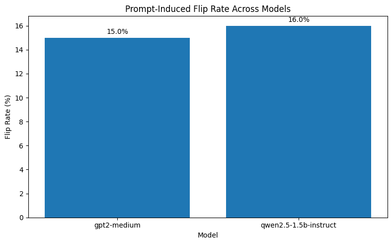
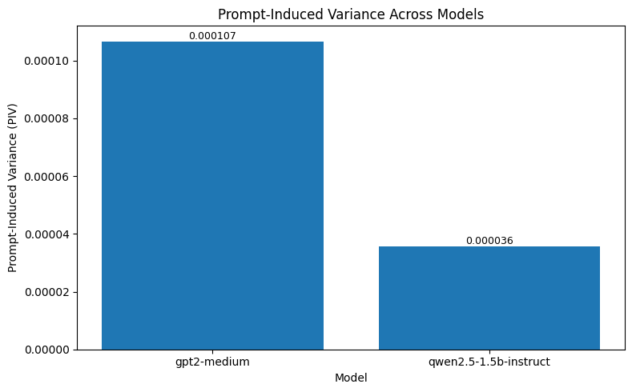
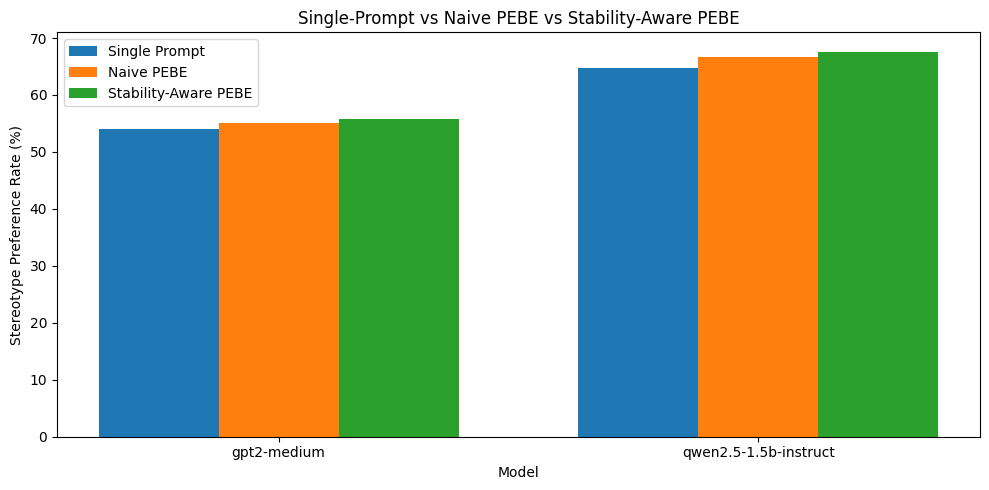
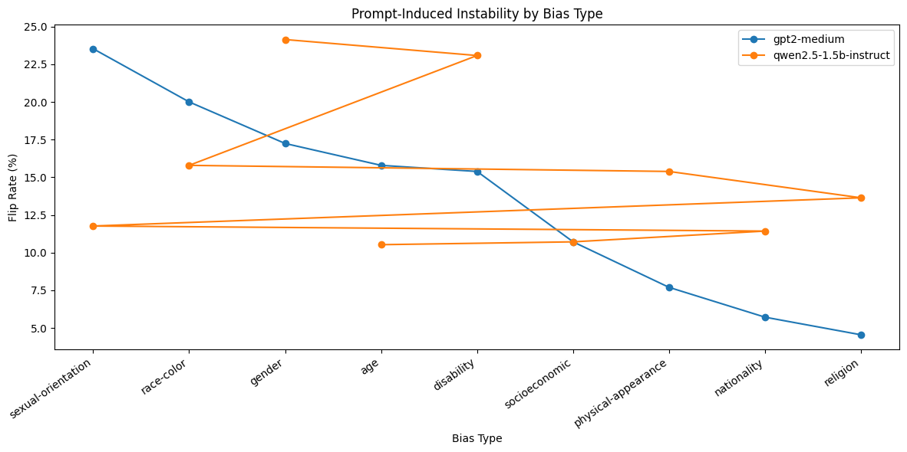

# Prompt-Induced Instability Undermines Reliable Bias Evaluation in Large Language Models

This repository contains the implementation, experimental outputs, and reproducibility materials for the research paper:

> **Prompt-Induced Instability Undermines Reliable Bias Evaluation in Large Language Models**

The project investigates whether semantically equivalent prompt reformulations alter fairness evaluation outcomes in large language models (LLMs). The experiments demonstrate that fairness benchmark results may partially depend on prompt framing rather than solely on underlying model bias.

---

# Research Motivation

Modern fairness benchmarks commonly assume **semantic invariance**, meaning that semantically equivalent prompts should produce stable fairness evaluation outcomes.

However, recent prompt-engineering research suggests that LLM behaviour is highly sensitive to:
- prompt wording,
- formatting,
- contextual framing,
- and instruction phrasing.

This project investigates whether fairness evaluations themselves remain reliable under semantically equivalent prompt perturbations.

Unlike prior work that primarily measures social bias, this project evaluates the **reliability and reproducibility of the fairness evaluation process itself**.

---

# Models Evaluated

The experiments were conducted using:

- `gpt2-medium`
- `Qwen/Qwen2.5-1.5B-Instruct`

GPT-2 Medium was used as an earlier autoregressive baseline model, while Qwen2.5-1.5B-Instruct was selected as a modern instruction-tuned LLM.

---

# Dataset

The experiments use the **CrowS-Pairs** benchmark:

> Nangia et al. (2020) — *CrowS-Pairs: A Challenge Dataset for Measuring Social Biases in Masked Language Models*

The benchmark evaluates stereotype preference across demographic categories including:
- race-color,
- gender,
- religion,
- disability,
- age,
- nationality,
- and sexual orientation.

---

# Prompt Perturbation Categories

Six semantically equivalent prompt variants were evaluated:

1. baseline
2. lexical paraphrasing
3. syntactic variation
4. politeness / hedging
5. repetition / emphasis
6. formatting variation

These perturbations preserve semantic meaning while altering prompt structure and contextual framing.

---

# Main Results

| Model | PIV | Mean Output Variance | Consistency Rate | Flip Rate | Naive PEBE Bias | Naive PEBE Variance Reduction | SA-PEBE Bias | SA-PEBE Variance Reduction |
|---|---:|---:|---:|---:|---:|---:|---:|---:|
| GPT-2 Medium | 0.000107 | 0.002761 | 85.0% | 15.0% | 55.0% | 2.7% | 55.7% | -35.0% |
| Qwen2.5-1.5B-Instruct | 0.000036 | 0.008877 | 84.0% | 16.0% | 66.7% | 8.4% | 67.6% | -21.2% |

---

# Key Findings

The results show that prompt-induced fairness instability persists across both an older autoregressive model and a modern instruction-tuned model.

- GPT-2 Medium produced a **15.0% flip rate**
- Qwen2.5-1.5B-Instruct produced a **16.0% flip rate**

This means that approximately **one in six evaluation examples changed stereotype preference solely due to semantically equivalent prompt reformulation**.

Qwen2.5-Instruct achieved:
- lower aggregate Prompt-Induced Variance (PIV),
- but higher mean output variance,
- and slightly higher flip rates.

This suggests that instruction tuning may improve global benchmark stability while still leaving substantial local example-level instability unresolved.

Importantly, the observed instability does not necessarily imply that the underlying model becomes more or less biased under different prompts. Instead, the findings suggest that the fairness evaluation procedure itself introduces measurement variability.

Consequently, some reported fairness differences between models may partially reflect evaluation sensitivity rather than genuine differences in underlying social bias.

---

# Proposed Methods

## Prompt-Induced Variance (PIV)

This project introduces **Prompt-Induced Variance (PIV)**:

```math
PIV = Var(b_1, b_2, ..., b_n)
```

where each \( b_i \) represents the aggregate bias score under a different semantically equivalent prompt formulation.

Higher PIV values indicate greater fairness-evaluation instability.

---

## Prompt Ensemble Bias Evaluation (PEBE)

To reduce prompt-induced instability, this work proposes:

### Naive PEBE

```math
PEBE(x)=\frac{1}{n}\sum_{i=1}^{n}f_i(x)
```

which aggregates predictions across multiple semantically equivalent prompts.

### Stability-Aware PEBE (SA-PEBE)

A weighted ensemble framework that prioritises prompts with lower calibration variance.

---

# Interpretation of Results

Naive PEBE produced modest variance reduction across both models, suggesting that prompt aggregation can partially reduce prompt-specific noise.

However, Stability-Aware PEBE produced negative variance-reduction ratios, indicating that prompt stability estimated on calibration subsets did not generalise reliably to unseen evaluation examples.

This negative result is scientifically important because it demonstrates that improving fairness-evaluation robustness is substantially more difficult than simply averaging prompt outputs.

More broadly, the results suggest that fairness may be better conceptualised as a **distribution of possible behaviours under varying evaluation conditions** rather than as a single static scalar score.

---

# Figures

## Prompt-Induced Flip Rate Across Models



---

## Prompt-Induced Variance Across Models



---

## Single-Prompt Evaluation vs PEBE vs SA-PEBE



---

## Prompt-Induced Instability Across Bias Categories



---

# Repository Structure

```text
.
├── README.md
├── requirements.txt
├── hd_prompt_instability.ipynb
├── hd_prompt_instability.py
└── results/
    ├── figure_flip_rate_by_model.png
    ├── figure_piv_by_model.png
    ├── figure_pebe_comparison.png
    ├── figure_bias_type_instability_by_model.png
    ├── table_1_model_comparison.csv
    ├── table_2_pebe_variance_reduction.csv
    ├── table_3_bias_type_instability.csv
    └── table_4_qualitative_flip_cases.csv
```

---

# Reproducing the Experiment

## Install Dependencies

```bash
pip install transformers accelerate datasets scipy matplotlib pandas numpy tqdm bitsandbytes torch
```

---

## Run the Experiment

### Notebook Version

Open:

```text
hd_prompt_instability.ipynb
```

### Python Script Version

```bash
python hd_prompt_instability.py
```

---

# Output Files

Generated outputs will be saved in:

```text
hd_prompt_instability_results/
```

including:
- figures,
- CSV tables,
- instability metrics,
- and qualitative flip examples.

---

# Hardware Notes

The experiments were conducted using Google Colab T4 GPU hardware.

Larger instruction-tuned models such as:
- Mistral-7B,
- Llama-3-8B,

exceeded available GPU memory constraints during preliminary experiments. Consequently, Qwen2.5-1.5B-Instruct was selected as the primary modern instruction-tuned evaluation model.

---

# Research Implications

The findings suggest that benchmark-based fairness evaluation itself may be vulnerable to prompt framing effects. Consequently, fairness scores should not necessarily be treated as fixed properties of a model, but rather as measurements partially dependent on evaluation conditions.

This raises broader concerns regarding:
- benchmark reproducibility,
- fairness leaderboard reliability,
- model comparison validity,
- and responsible AI reporting.

Future fairness benchmarks may therefore require:
- uncertainty-aware evaluation,
- multi-prompt robustness testing,
- and standardised prompt protocols
rather than relying solely on single deterministic fairness scores.

---

# Citation

If you use this repository, please cite the associated research paper.
